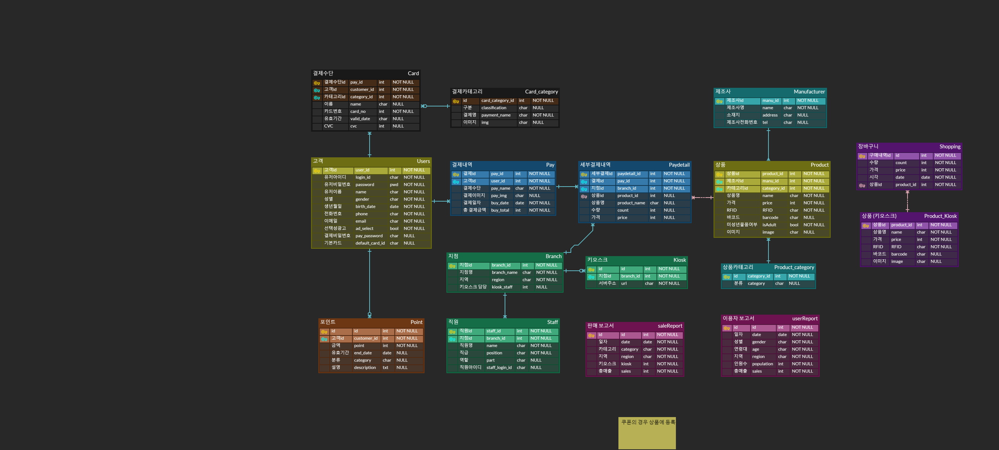
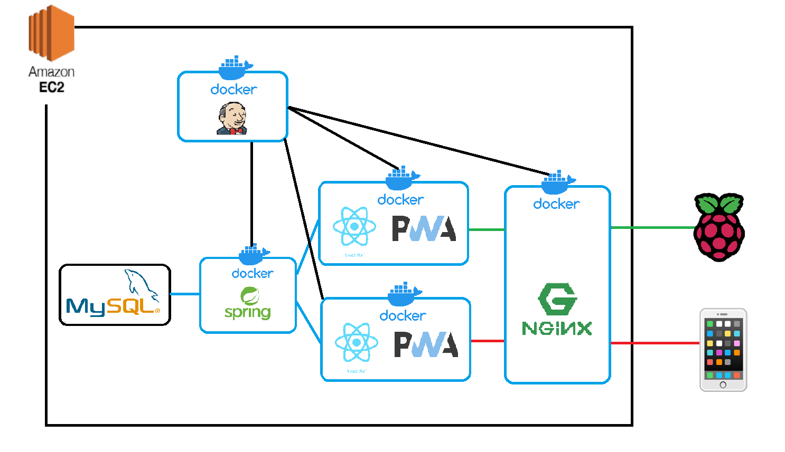

# Hishop Project

## Project

1. RFID를 이용하여 상품을 일괄인식하는 프로젝트
2. 프로젝트 기간 : 2023.01.09 ~ 2023.02.17 (6주)
3. 인원: 6명(강동훈, 박준수, 이영재, 정시언, 조용재, 최홍준)
4. 담당: FrontEnd(정시언, 박준수), Backend(조용재, 이영재), Deploy(조용재, 최홍준), Iot(강동훈, 최홍준)

## 기획서

자세히

 
 1. 현황과 이슈

주말이나 휴일의 대형마트에는 많은 고객이 몰립니다. 쇼핑을 끝낸 수많은 고객들은
결제를 위해 계산대로 모이면서 병목현상이 발생해 지루한 대기시간이 발생하게 됩니다.
이러한 고객들의 불쾌한 경험은 마트에 대한 부정적인 이미지로 연결됩니다.

2. 목적
고객이 계산대에서 오래 대기하는 이유를 고민해본 결과, 결제 과정을 3단계로 나눌 수
있었습니다. 구매할 물품을 카트에서 꺼내고, 바코드를 읽고 물품을 확인한 후 카트에 담는
3단계의 기존 결제 방식은 많은 시간이 소요된다고 생각했습니다. 이 과정의 간소화를 통해
이용자들의 불만 개선할 방법을 모색하였습니다.

3. 추진방향
진열대에서 카트에 물품을 담을 때 바코드를 찍는다면 계산대에서의 시간을 단축할 수
있을 것이란 생각에 도달하였습니다. 이 과정에서 구매내용을 확인하기 위해 어플이
필요하다고 판단하였고, 동시에 어플을 통해 결제까지 진행함으로써 계산과정의 편의성을
증가시켰습니다. 다만, 이 방식은 도난 위험이 커질 수 있다고 판단되어 해결방안을 고민한
결과, 제품에 RFID 태그를 부착하여 확인하는 방법으로 이에 대한 불안을 줄였습니다.

4. 기능구성

a. 주요 기기
	- 목록 작성/결제용 어플
		- PWA를 이용한 구현
		- 회원기능(로그인/회원가입), 결제수단(카드, 카카오페이 등) 및 기본 결제수단 등록, 구매내역 등 표시
	- 상품
		- 상품마다 RFID 태그 부착
		- 단, 너무 싼 상품 또는 주류 등은 예외발생용 RFID 부착 및 바코드 스캐너로읽기
	- RFID존 - 키오스크 (가명)
		- RFID 센서(상품 읽기용)
		- 2차원 바코드 리더기(QR코드 및 상품 바코드 읽기용)
		- 카드 리더기(삼성페이 포함)
		- 직원 호출용 등불
		- 터치 스크린(화면)
b. 핵심기능
	- 유저 로그인, 회원가입
		- 유저가 로그인하고 회원가입을 할 수 있는 창을 띄운다. (프론트)
		- 회원가입 시 유저 DB에 회원 정보를 추가한다. (백엔드)
	- 결제 수단 등록
		- 기본 카드-페이를 설정할 수 있다. (프론트)
		- 연동 시 유저 DB에 지갑 정보를 추가한다 (백엔드)
	- 상품 정보 등록
		- 상품정보는 RFID 리더기로 1차적으로 읽어드린다. (하드웨어)
		- 오류 및 예외처리 등의 남은 상품은 2차원 바코드 리더기로 바코드를 찍는다.(하드웨어)
		- 상품 다시 읽기 버튼을 넣는다.(프론트)
		- 백엔드에서 받은 장바구니 정보를 화면에 보여준다. (프론트)
		- 구매 내역 변경버튼은 직원용바코드 추가 입력 시 가능하게 한다.(프론트)
		- 결제 버튼 클릭 시 구매 내역을 DB로 보낸다.
	- 상품 정보 수정
		- 프론트에서 상품목록 삭제 버튼 구현. 클릭 시 확인 후 장바구니에서 삭제(프론트)
		- 삭제버튼 최종 클릭 시 장바구니 DB에서 해당 레코드 삭제(백엔드)
	- RFID존 통과 및 결제
		- 결제
			- 결제 알림창 표시(프론트)
			- 결제가 되었다면 상품 DB에서 재고 감소 및 해당 RFID태그 말소(백엔드)
			- 키오스크에 QR코드 띄우기(프론트, 백엔드)
				- 어플에 결제 내용을 받아 서버로 결제요청 전송
			- 모바일 앱에 QR코드 띄우기(프론트, 백엔드)
				- 키오스크에서 고객 내용을 받아 서버로 결제요청 전송
			- 모바일 QR리더기(백앤드)
		- 상품 확인
			- 상품 RFID를 읽어 서버에 전송 (하드웨어)
			- RFID DB에서 해당 RFID의 제품 확인 (백엔드)
			- 장바구니 DB에서 전송받은 제품을 카운트 (백엔드)
			- 장바구니 DB와 RFID 카운트를 비교 (백엔드)
			- 두 자료가 일치하면 결제 버튼 활성화 후 결제 진행 (프론트)
			- 키오스크에 이상이 있을 경우 직원 호출용 등불 점등(백엔드,하드웨어)
	- 관리자페이지에서 유저,상품관리(어플)
c. 부가기능
	● 제품위치 파악 (어플, 백엔드)
	● 직원 알람(백엔드)
	● 셔터 (하드웨어)
	● 모바일에서 수량변경 (어플, 백엔드)
	● 본인인증 (어플, 백엔드)
	● 할인쿠폰 - 음수 가격의 상품(백엔드, 프론트)
	
5.기대효과
	- 혼잡한 시간대에 계산을 위해 줄을 서서 오랜 시간 기다려야 하는 이용자의 불편을 개선할 수 있다.
	- 간편한 결제 방식으로 이용자에게 더욱 편리한 경험을 제공할 수 있다.
	- 기업측에선 유동 인구의 증가로 동 시간대에 더욱 많은 인원을 받을 수 있다.

## 기능 명세서
[Link](https://docs.google.com/spreadsheets/d/10z_6CAAoNS_wLIKpQsJXNyHBNbho21VhaSlaCbY6lBA/edit?usp=sharing)

## API 명세서
[Link](https://amused-whimsey-173.notion.site/61c5a9709a104cd0bc66c0d13bf0286e?v=74ef36de2b374c96af55e3ea3c4aa1ae)

## ERD

## Architecture

