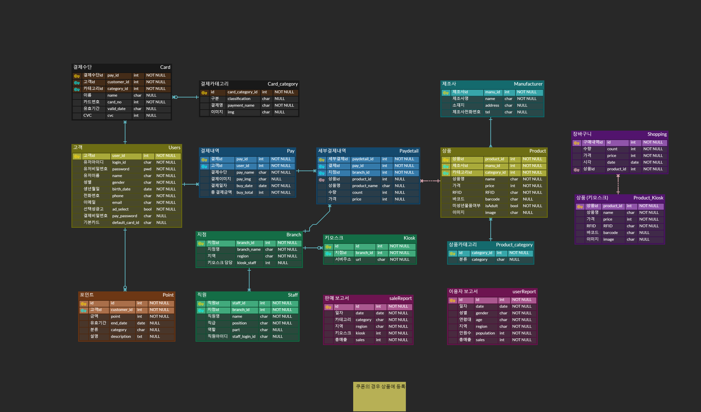

# Hishop Project

## Project

1. RFID를 이용하여 상품을 일괄인식하는 프로젝트
2. 프로젝트 기간 : 2023.01.09 ~ 2023.02.17 (6주)
3. 인원: 6명(강동훈, 박준수, 이영재, 정시언, 조용재, 최홍준)
4. 담당: FrontEnd(정시언, 박준수), Backend(조용재, 이영재), Deploy(조용재, 최홍준), Iot(강동훈, 최홍준)

## 기획서
[Link](https://docs.google.com/document/d/154Xodc60hpvbyzb_FLN7esR6akNYOfyXL_r8dqfFevA/edit?usp=sharing)

## 기능 명세서
[Link](https://docs.google.com/spreadsheets/d/10z_6CAAoNS_wLIKpQsJXNyHBNbho21VhaSlaCbY6lBA/edit?usp=sharing)

## API 명세서
[Link](https://amused-whimsey-173.notion.site/61c5a9709a104cd0bc66c0d13bf0286e?v=74ef36de2b374c96af55e3ea3c4aa1ae)

## ERD

## Architecture

